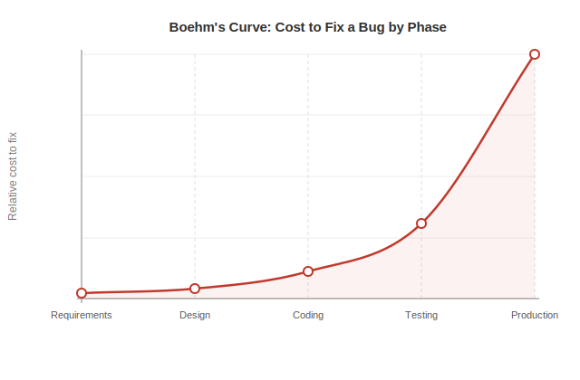
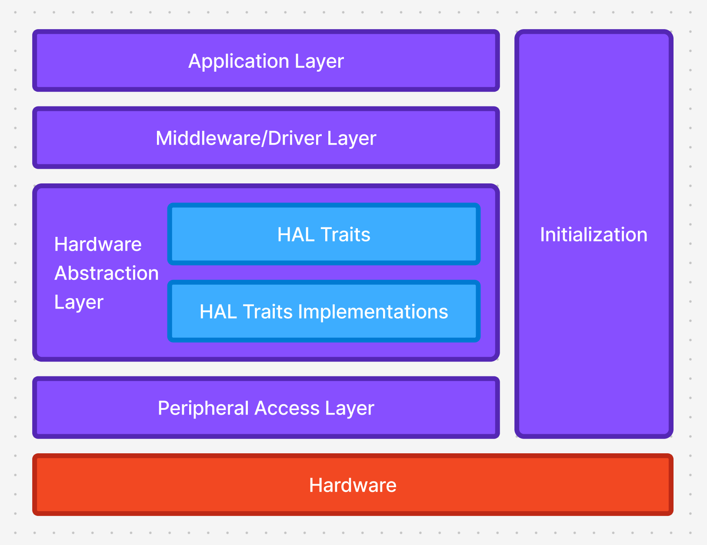
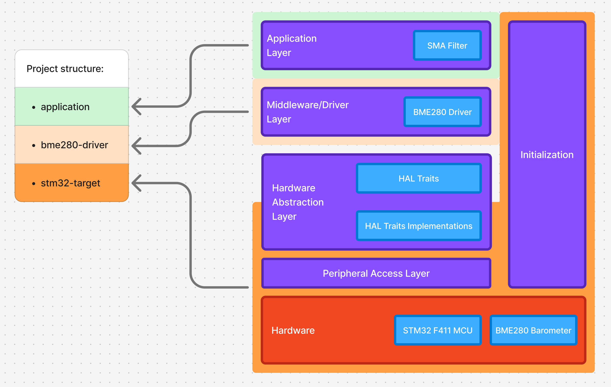
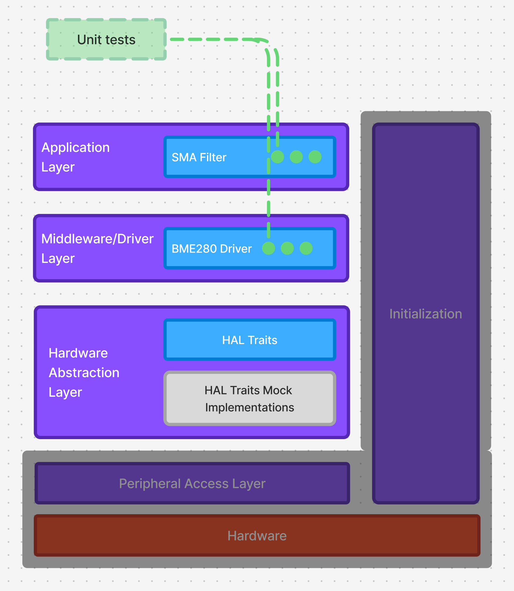
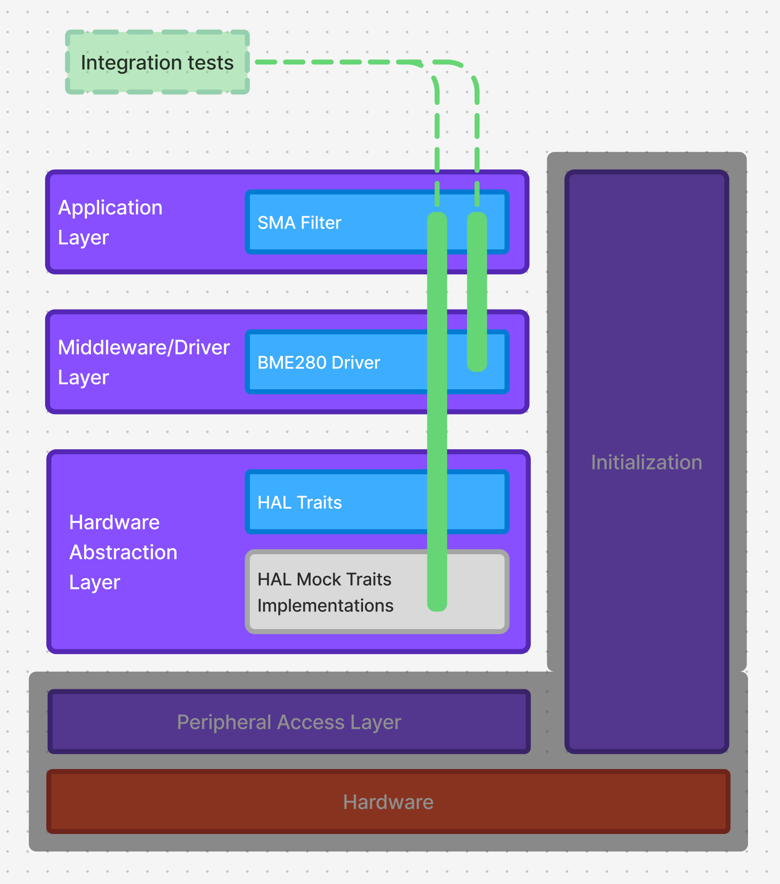

# Testing Embedded Applications with Rust: From Unit Tests to Hardware-in-the-Loop

- [Ukrainian version of the article](TODO)
- [Source code](https://github.com/sulevsky/testing_in_embedded_with_rust) 

## 1. The Cost of a Bug: Where Rust Fits In
Shipping a bug in an embedded product is expensive. Unlike web apps, where a new version is deployed in minutes, embedded devices in the field are hard and costly to update or may never receive an update at all. This is what Boehm's curve quantifies: the cost of fixing a defect grows by an order of magnitude for every product lifecycle phase it survives undetected. The earlier a bug is caught, the cheaper the fix. Moving defect detection upstream - into the development phase - is one of the best investments an embedded project can make.



This is where Rust's growing adoption in the embedded ecosystem becomes particularly relevant. From a quality perspective, Rust offers two important advantages:
- Embedded development often deals directly with memory, making memory bugs easy to introduce. Rust's ownership model eliminates this entire class of bugs at compile time.
- Its type system encodes hardware constraints directly. Invalid configurations become compile-time errors, not runtime failures. The example below shows exactly this.

To make this concrete: on the STM32F446RE microcontroller, the I2C1 clock line can only be connected to pins PB6 or PB8 (datasheet p.59). But if you accidentally configure pin 15 instead, the C HAL won't complain - the IDE and compiler have no way to catch it, leaving you or your users to discover the bug at runtime.  

```c
void HAL_I2C_MspInit(I2C_HandleTypeDef* hi2c)
{
  GPIO_InitTypeDef GPIO_InitStruct = {0};
  if(hi2c->Instance==I2C1)
  {
    __HAL_RCC_GPIOB_CLK_ENABLE();
    GPIO_InitStruct.Pin = GPIO_PIN_15|GPIO_PIN_7;
    // this is an error --^^^^^^^^^^^
    // should be GPIO_PIN_6
    GPIO_InitStruct.Mode = GPIO_MODE_AF_OD;
    GPIO_InitStruct.Pull = GPIO_NOPULL;
    GPIO_InitStruct.Speed = GPIO_SPEED_FREQ_VERY_HIGH;
    GPIO_InitStruct.Alternate = GPIO_AF4_I2C1;
    HAL_GPIO_Init(GPIOB, &GPIO_InitStruct);
    __HAL_RCC_I2C1_CLK_ENABLE();
  }
}
```

But let's try the same in Rust with a wrong pin.

```rust
let i2c1_scl = gpiob.pb15.into_alternate_open_drain::<4>();
// error ------------^^^^
// should be `pb6`
``` 

The compiler catches it immediately - no runtime debugging needed.

```
error[E0277]: the trait bound `stm32f4xx_hal::gpio::Pin<'B', 15>: gpio::marker::IntoAf<4>` is not satisfied
  --> stm32-target/src/main.rs:34:31
   |
34 |     let i2c1_scl = gpiob.pb15.into_alternate_open_drain::<4>();
   |                               ^^^^^^^^^^^^^^^^^^^^^^^^^ the trait `gpio::marker::IntoAf<4>` is not implemented for `stm32f4xx_hal::gpio::Pin<'B', 15>`
   |
```

Even more, the compiler points to the valid options: pins 6 and 8.

```
help: the following other types implement trait `From<T>`

stm32f4xx_hal::gpio::alt::i2c1::Scl implements From<stm32f4xx_hal::gpio::Pin<'B', 6, MODE>>
stm32f4xx_hal::gpio::alt::i2c1::Scl implements From<stm32f4xx_hal::gpio::Pin<'B', 8, MODE>>
```

Rust's type system moves hardware misconfiguration errors into compile time - catching bugs earlier, where they cost the least to fix. But it cannot catch mistakes in business logic. For that, we need tests: unit tests for isolated components, integration tests for component interaction, and hardware-in-the-loop tests for the real hardware. That is exactly what this article covers.

## 2. Structuring Embedded Code for Testability
Before setting up the project and writing code, we have to discuss an important design principle that will help us create a testable application. That is Separation of Concerns (SoC) - it dictates that a software system should be divided into distinct sections, where each section addresses a separate, isolated responsibility (concern). Though separation of concerns is a fundamental design principle affecting most aspects of software development (e.g. portability), we're discussing it here mostly in the context of testing.

So let's split a typical embedded application into layers.

In this quite simplified diagram we have:
- Application layer - responsible for business logic, specific to the problem we're solving with the application.
- Middleware/Driver layer - bridges hardware-independent business logic and hardware-dependent interfaces. Often it's split into two layers.
- Hardware Abstraction Layer - decouples upper layers from *specific* hardware architecture. This is done with two components `embedded-hal` traits, and hardware-specific trait implementations (e.g. `stm32f4xx-hal`). Upper layers know only about `embedded-hal` traits.
- Peripheral Access Layer - is the lowest software layer, sitting directly above the physical hardware registers. It provides a raw, 1-to-1 digital representation of the MCU's hardware register map.
- Hardware - represents the actual physical silicon and electronic components of the system.
- Initialization - this is a special component, it's a block responsible for instantiating concrete HAL trait implementations, injecting them into the Drivers or Middleware, and passing the fully constructed system to the Application Layer to start execution.

We will return to this architecture many times, to underline how different testing approaches fit within this layout, which parts will be tested and how.  

## 3. The Demo Project
The next step before is to describe our demo example. We're going to create a very simple project for measuring temperature and printing the result.
The hardware components are:
  -  STM32F446RE MCU 
  -  BME280 barometer
The business logic consists of a simple moving average filter. The goal is not to build a production app solving some real problems, but a minimal one to learn how to structure code for testability. Understanding testing on a simple example makes it easy to transfer that knowledge to more complex projects.  

### Project Structure
Now we're ready to set up the project structure according to the architecture. We'll split components into Rust workspaces.

- Directory structure
```
.
├── Cargo.toml
├── app
│   ├── Cargo.toml
│   └── src
│       └── lib.rs
├── bme280-driver
│   ├── Cargo.toml
│   └── src
│       ├── baro.rs
│       └── lib.rs
└── stm32-target
    ├── .cargo
    │   └── config.toml
    ├── build.rs
    ├── Cargo.toml
    ├── memory.x
    └── src
        └── main.rs
```

- root Cargo.toml
```toml
[workspace]
members = [
    "application",
    "bme280-driver",
    "stm32-target",
]
```

If we return to our architecture, we'll see that the project structure directly maps to the architecture layers.



Note: HAL traits are provided by the `embedded-hal` crate and do not depend on hardware choice. That's why on the diagram the traits thenmselves are not included in the `stm32-target` package, but trait implementations are included. 
  
All hardware-dependent code is in the `stm32-target` package:
- `.cargo/config.toml` - local Cargo configuration file, we specify a build target for cross-compilation 
```toml
[build]
target = "thumbv7em-none-eabihf"
```
- build.rs - with required flags for linker
- memory.x - defines flash/RAM sizes and addresses

## 4 Unit tests
We will start testing from the simplest, yet important, part - unit testing.  With proper separation of architectural components the business logic and middleware can be tested independently from each other and independently from lower layers HAL/PAC/Hardware. The key benefit: unit tests are easy to write, fast to runm and require no specific hardware. This makes development experience with unit tests remarkably smooth.


Rust provides a great infrastructure for unit tests, usually they live near the code under test (i.e. in the same file).
```
.
├── application
│   └── src
│       └── lib.rs  <---- unit tests are here, near the code under test
└── bme280-driver
    └── src
        └── baro.rs <---- unit tests are here, near the code under test
```
Let's see some code examples. In the file `application/src/lib.rs` we have an implementation of a simple moving average filter for noisy sensor data (`SMABuffer` struct), this simple example represents our business logic. `SMABuffer` is decoupled from other code and can be tested independently. 

```rust
#[cfg(test)]
mod tests {
    extern crate std;
    use std::prelude::v1::*;
    use crate::*;
    
    #[test]
    fn average_of_multiple_samples() {
        let mut buffer: SmaBuffer<8> = SmaBuffer::new();
        for i in 0..buffer.capacity() {
            buffer.push(i as i32);
        }
        assert_eq!(buffer.average(), (buffer.capacity() - 1) as i32 / 2);
    }
}
```
In embedded development, production code typically targets a bare-metal environment - no OS and therefore we can't use standard library (`std-crate`), but a platform-agnostic subset of `std-crate`, called `core-crate`. The `#![no_std]` attribute signals this. But unit and integration tests won't run in a bare-metal environment, they will run on a developer's machine or CI server, where the full standard library is available. That's why the test module imports `std-crate` and explicitly imports the standard prelude - all the things Rust normally injects in every module automatically (`Option`, `Vec`, `String`, `Iterator`, etc.). And it's not just `std-crate`, any third-party crate that requires `std-crate` is available in tests too, even if it can't be used in production code. The result is that tests have none of the constraints of the production environment, which makes them straightforward to write. 

## 5. Unit Tests with Mocks
Components that are isolated are easy to test with just unit tests, like our `SMABuffer`. But very often components under test depend on other components, like a barometer driver that depends on an I2C bus, for that we need to mock a dependency.
In the baro driver we use the `embedded_hal::i2c::I2c` trait and we can create a mock implementation with hardcoded responses and test if baro handles those responses properly.
There is a great [video from Digikey](https://youtu.be/n7q4WYA9qVY?si=zL03sYnbIZVp-Xvt) explaining how to do it.
But we will take a simpler approach and take `embedded-hal-mock` crate with ready-made mock implementations for `embedded-hal` traits. For example, mocking I2C is done with just a couple of lines.
```rust
let expected = vec![Transaction::write_read(0x77, vec![0xD0], vec![0x42])];
let mut i2c = i2c::Mock::new(&expected);
```

Let't see an example of a test with a mock.

```rust
#[cfg(test)]
mod tests {
    extern crate std;
    use std::prelude::v1::*;
    use embedded_hal_mock::eh1::i2c::{self, Transaction};
    use super::*;

    #[test]
    fn read_id() {
        let expected = vec![Transaction::write_read(0x77, vec![0xD0], vec![0x42])];
        let mut i2c = i2c::Mock::new(&expected);
        let baro = Baro::new(BARO_DEVICE_ADDR_SDO_VCC);
        let id = baro.read_id(&mut i2c).unwrap();
        i2c.done();
        assert_eq!(id, 0x42);
    }
}
```
Aside from asserting responses from the component under test we can ensure that required calls were made to the mock (`i2c.done()`).
Ironically, the main strength of unit tests - testing code in isolation is also the limitation. Big part of application complexity resides not in the components themselves, but in component interactions. This part we'll cover in the next section - integration tests. The second limitation that they don't test real hardware.

## 6. Integration Tests
Rust has infrastructure for integration tests as well. Integration tests depend on separation of layers even more than unit tests. The main focus has to be on HAL<->Driver layer separation. The standard solution is to depend on `embedded-hal` traits rather than concrete implementations, so we can replace real implementations with mocks in tests. This requires some setup, but shares unit tests' key benefit: fast execution time.



Since integration tests do not belong to a specific layer or component, we extract them into a separate package, so we add a new member to root `Cargo.toml`.
```toml
[workspace]
members = [
    "bme280-driver",
    "stm32-target",
    "application",
    "integration-tests", # <-- added
]
```

We also adjust the project structure with a new package - `integration-tests`. 

```
.
├── application
├── bme280-driver
├── stm32-target
└── integration-tests                   <-- added
    ├── Cargo.toml                      <-- added
    └── tests                           <-- added
        └── filtered_sensor_tests.rs    <-- added
```

Let's have a look at an integration test example.

```rust
mod tests {
    use application::SmaBuffer;
    use bme280_driver::Baro;
    use embedded_hal_mock::eh1::i2c::{self, Transaction};

    #[test]
    fn filtered_temperature_basic_test() {
        let dummy_i2c_address = 0x42;
        let expected = vec![
            Transaction::write_read(dummy_i2c_address, vec![0x88], vec![0; 24]),
            Transaction::write(dummy_i2c_address, vec![0xF4, 0x27]),
            Transaction::write_read(dummy_i2c_address, vec![0xF7], vec![0; 6]),
        ];
        let mut i2c_mock = i2c::Mock::new(&expected);
        let baro = Baro::new(dummy_i2c_address)
            .calibrated(&mut i2c_mock)
            .unwrap();
        let mut sma_buffer: SmaBuffer<8> = SmaBuffer::new();
        let sensor_data = baro.read_sensor(&mut i2c_mock).unwrap();
        sma_buffer.push(sensor_data.temperature);
        i2c_mock.done();
        assert_eq!(sma_buffer.average(), sensor_data.temperature);
    }
}
``` 

We are using components from distinct layers (`application` and `bme280_driver`), so this is not testing in isolation. Integration tests partially solve the problem of testing complexity of component interactions. But the fact that they run on a developer's machine or CI server doesn't allow us to test layers of the application interacting directly with hardware - the initialization code, real HAL and PAC layers, the shaded parts of the diagram.

## 7. Target Tests - Hardware in the Loop
A large part of the stability of the embedded system depends on the hardware part (proper initialization and configuration). We tried to abstract away the hardware part, but small misconfiguration in initialization can make the whole system misbehave.


We already have a place that is not abstracted from the hardware - `stm32-target`, and that will be the place for the tests that target specific hardware. 

Purpose of these tests:
  - ensure initialization or some part of initialization phase works as expected and changes in code do not introduce regressions
  - ensure changes in the hardware (e.g. new MCU, changed pinout, etc.) work as expected

Let's update the project and add target tests (an `initialization_tests.rs` file).
```
.
├── application
├── bme280-driver
├── integration-tests
└── stm32-target
    ├── build.rs
    ├── Cargo.toml
    ├── memory.x
    ├── src
    │   └── main.rs
    └── tests
        └── initialization_tests.rs    <-- added
```
For target testing we're using an `embedded-test` crate, for that we have to do some setup.

1. add a dev dependency to package `Cargo.toml`
```toml
[dev-dependencies]
embedded-test = { version = "0.7.1", features = ["defmt"] }
```
2. disable standard test runner for every test file in package `Cargo.toml`, we have just one at the moment
```toml
[[test]]
name = "initialization_tests"
harness = false
```
3. add instruction for the linker in `build.rs` file
```rust
fn main() {
    println!("cargo::rustc-link-arg=--nmagic");
    println!("cargo::rustc-link-arg=-Tlink.x");
    println!("cargo::rustc-link-arg=-Tdefmt.x");

    // add stm32-target dir for linker search to find memory.x 
    println!("cargo::rustc-link-search=stm32-target");
    // target tests 
    println!("cargo::rustc-link-arg-tests=-Tembedded-test.x"); // <-- added
}
```

Let's review an example of a target test and point to some important parts
```rust
#![no_std]
#![no_main]

#[embedded_test::tests]
mod tests {
    use bme280_driver::Baro;
    use bme280_driver::baro::BARO_DEVICE_ADDR_SDO_VCC;
    use defmt::assert_eq;
    use defmt_rtt as _;
    use stm32f4xx_hal::{
        gpio::GpioExt,
        i2c,
        prelude::*,
    };

    struct Peripherals {
        core_peripherals: cortex_m::Peripherals,
        device_peripherals: stm32f4xx_hal::pac::Peripherals,
    }

    #[init]
    fn init() -> Peripherals {
        Peripherals {
            core_peripherals: cortex_m::Peripherals::take().unwrap(),
            device_peripherals: stm32f4xx_hal::pac::Peripherals::take().unwrap(),
        }
    }

    #[test]
    fn bme280_connection_test(peripherals: Peripherals) {
        let dp = peripherals.device_peripherals;
        let mut rcc = dp.RCC.constrain();
        let gpiob = dp.GPIOB.split(&mut rcc);
        let i2c1_scl = gpiob.pb6.into_alternate_open_drain::<4>();
        let i2c1_sda = gpiob.pb7.into_alternate_open_drain::<4>();

        let mut i2c = stm32f4xx_hal::i2c::I2c::new(
            dp.I2C1,
            (i2c1_scl, i2c1_sda),
            i2c::Mode::standard(100.kHz()),
            &mut rcc,
        );
        let bme280 = Baro::new(BARO_DEVICE_ADDR_SDO_VCC)
            .calibrated(&mut i2c)
            .unwrap();
        let id = bme280.read_id(&mut i2c).unwrap();
        assert_eq!(id, 0x60);
    }
}

```
1. Test will run on target device - `#![no_std]` is required, and we can't use standart library for these tests
2. Using `embedded-test` runner - `#[embedded_test::tests]`
3. Reuse of shared setup logic in `fn init()` function, returned `Peripherals` will be available as an argument for testing methods.
4. Test validates subset of operations of initialization phase of application `fn bme280_connection_test(peripherals: Peripherals)`
5. Using `defmt::assert_eq` for pretty-printed assertion messages

To run target tests we need to execute (target must be properly connected)
```sh
(cd stm32-target && cargo test)
```
And we will have a clen test report
```
Finished `test` profile [unoptimized + debuginfo] target(s) in 1.32s
  Running tests/initialization_tests.rs (testing_in_embedded_with_rust/target/thumbv7em-none-eabihf/debug/deps/initialization_tests-b950e2b189e37a02)
      Erasing ✔ 100% [####################]  64.00 KiB @  43.24 KiB/s (took 1s)
  Programming ✔ 100% [####################]  60.00 KiB @  33.89 KiB/s (took 2s)     Finished in 3.36s

running 1 test
test tests::bme280_connection_test ... [INFO ] Test exited with () or Ok(..) (embedded_test embedded-test-0.7.1/src/fmt.rs:36)
ok

test result: ok. 1 passed; 0 failed; 0 ignored; 0 measured; 0 filtered out; finished in 0.17s
```

Target tests have some limitations:
   1. They depend on specific hardware, we can't write a single tests for all the platforms. And in fact we don't want to do it, in target tests we want to embrace hardware differences and ensure we understand them correctly
   2. They take more time to run, due to target flashing and run on a slow CPU
   3. Harder to set up, requires hardware wiring, can be an issue in remote environment
   4. Hard to integrate with a CI pipeline (though possible, see an [awesome article from Ferrous Systems](https://ferrous-systems.com/blog/gha-hil-tests/))  
   5. Hard to run in parallel
   6. Limited to `core-crate`, no access to Rust standard library and third party crates requiring `std-crate`.

With all these limitations, the scope of target tests should be limited to initialization, full-stack integration checks, and hardware quirks worth documenting in tests. For everything else, prefer unit or integration tests. 

## Summary

Testing embedded software is uniquely critical: defects that reach the field are expensive to fix and sometimes impossible to patch. While Rust helps by catching a whole class of hardware misconfiguration errors at compile time, it cannot validate business logic - for that, we need tests.
Architecture is the foundation of testable embedded applications. Separation of Concerns, enforced through layered design and `embedded-hal` traits, is what enables all three levels of testing covered in this article: unit tests for isolated components, integration tests for component interactions, and target tests for real hardware. Each layer catches different classes of bugs. Together they form a complete testing strategy that shifts defect detection upstream - where, as Boehm's curve shows, the cost of fixes is minimal.


## Resources
1. [Rust book's section on automated tests](https://doc.rust-lang.org/book/ch11-00-testing.html)
2. [A great explanation of why portability matters from The Embedded Rust Book](https://docs.rust-embedded.org/book/portability/index.html)
3. [Article on testing in embedded systems with Rust from Ferrous Systems, provides examples for target testing with `defmt-test`, instead of `embedded-test`](https://ferrous-systems.com/blog/test-driver-crate/)
4. [DigiKey's video on testing embedded systems with Rust](https://www.youtube.com/watch?v=n7q4WYA9qVY)
